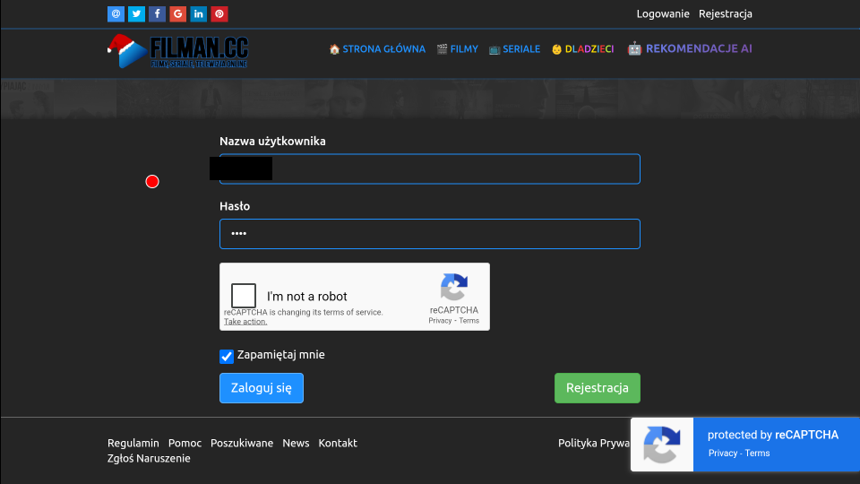
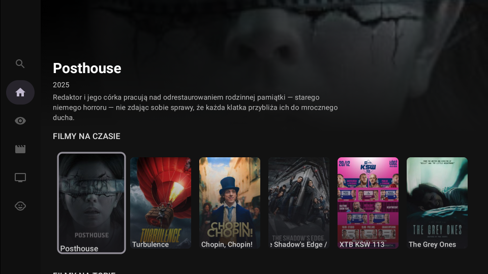
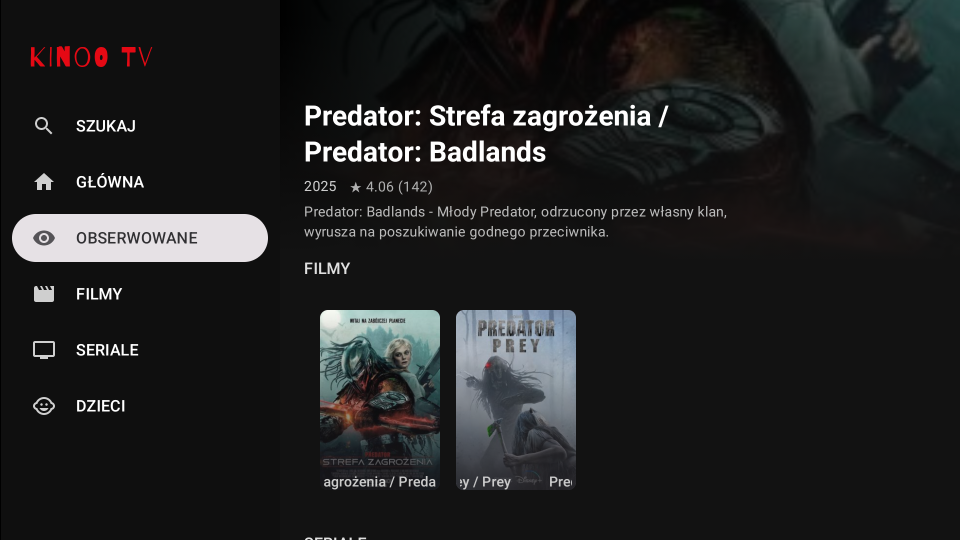
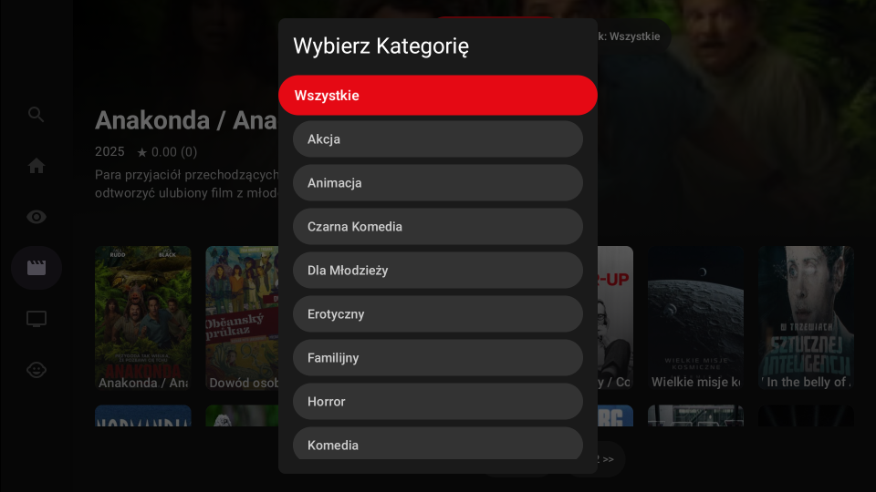
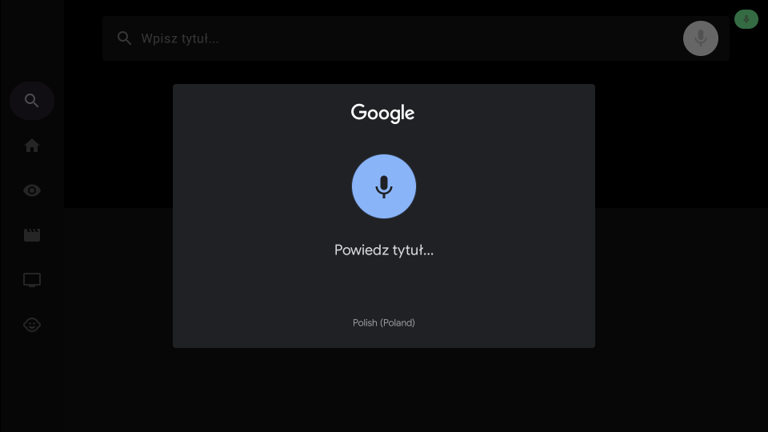
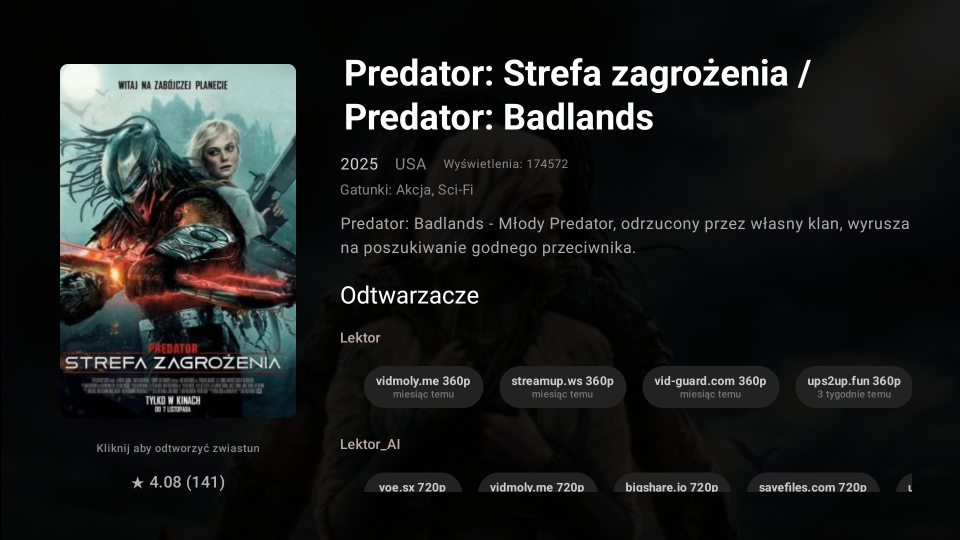
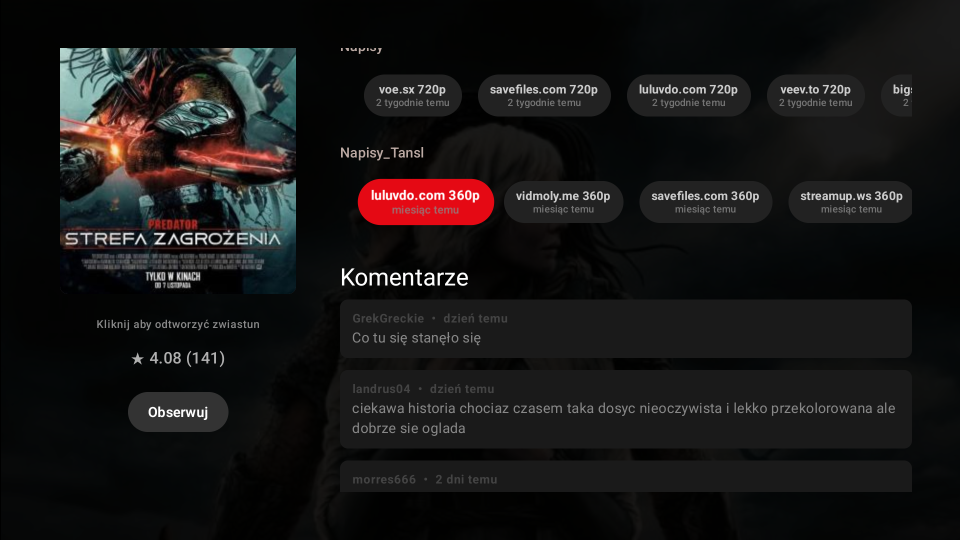
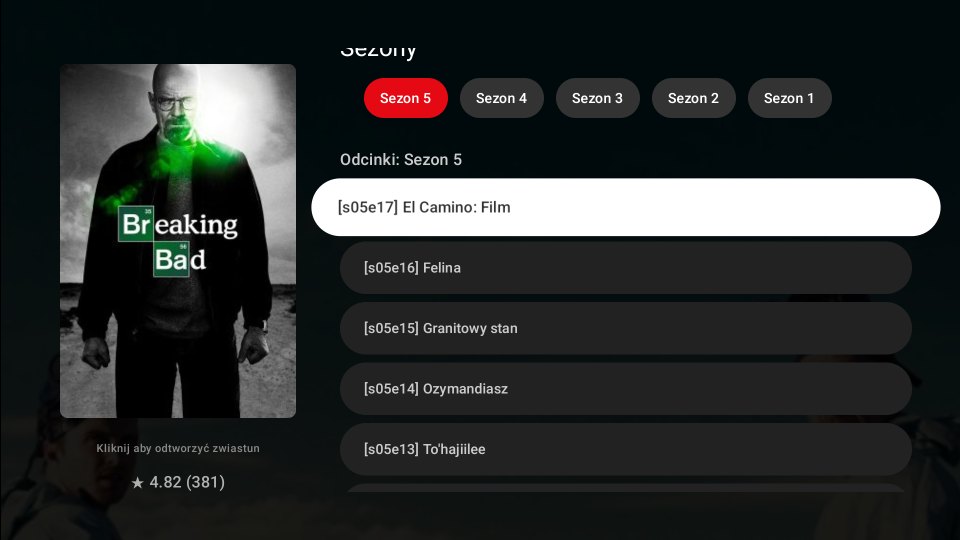
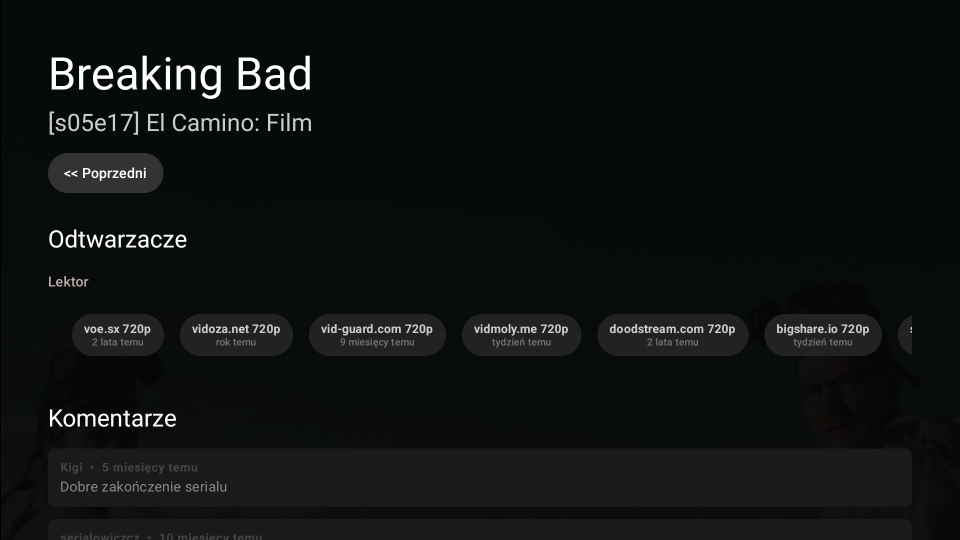

# 🎬 Kinoo TV - Android TV Client

**Kinoo TV** to natywna aplikacja na system Android TV, stworzona jako **projekt edukacyjny (Proof of Concept)**. Służy jako nieoficjalny klient serwisu streamingowego, demonstrując możliwości bibliotek **Jetpack Compose for TV** oraz technik parsowania danych w języku Kotlin.

## ✨ Główne Funkcjonalności

* **📺 Nowoczesny UI:** Interfejs zaprojektowany specjalnie pod piloty TV (D-pad navigation) przy użyciu Material3.
* **🔍 Wyszukiwanie Głosowe:** Oprócz normalnego wyszukiwania tekstowego dostępna jest integracja z systemowym mikrofonem pilota do szybkiego wyszukiwania filmów i seriali.
* **🎥 Zwiastuny YouTube:** Możliwość bezpośredniego podglądu zwiastunów (trailerów) filmów i seriali wewnątrz aplikacji.
* **🖱️ Virtual Cursor:** Unikalny system wirtualnego kursora do obsługi trudnych elementów webowych (np. logowania CAPTCHA).
* **☁ Cloud Synchronizacja:** Lista obserwowanych synchronizowana w czasie rzeczywistym między urządzeniami dzięki **Firebase Realtime Database** (możliwość współpracy z [rozszerzeniem do przeglądarki](https://github.com/konradcz2001/KinooTV-Extention)).
* **🤖 Smart Scraping:** Automatyczne pobieranie metadanych, plakatów, ocen i opisów bezpośrednio ze strony źródłowej.
* **⏯️ Player Links:** Agregacja i sortowanie linków wideo (priorytetyzacja: Dubbing PL > Lektor > Napisy).
* **🛡️ Odtwarzanie bez reklam:** Linki przekierowują do zewnętrznej przeglądarki. Dla najlepszych wrażeń zaleca się instalację przeglądarki z funkcją **wykrywania i przechwytywania wideo** (co eliminuje reklamy i pozwala używać natywnego odtwarzacza). Polecane rozwiązanie: **[browser-app.com](https://browser-app.com)**.
* **👶 Tryb Kids:** Dedykowana sekcja z bajkami i animacjami.
* **🌐 Wsparcie wielojęzyczne:** Interfejs dostępny w języku polskim i angielskim (automatyczne dopasowanie do ustawień systemu).

## 📸 Screenshots

#### 
Ekran logowania

Po przytrzymaniu przycisku wejścia na pilocie pojawia się kursor, którym trzeba potwierdzić CAPCHA. Login i hasło są autouzupełniane. Czynność tą wykonujemy raz, aż do momentu wygaśnięcia sesji i konieczności ponownego logowania.

#### 
Strona główna

#### 
Obserwowane

#### 
Filtry

#### 
Wyszukiwanie głosowe

#### 
Strona filmu

#### 
Strona serialu

## 🛠️ Stack Technologiczny

Aplikacja wykorzystuje sprawdzone biblioteki i wzorce architektoniczne:

* **Język:** [Kotlin](https://kotlinlang.org/)
* **UI:** [Jetpack Compose for TV](https://developer.android.com/training/tv/playback/compose)
* **Networking:** [OkHttp](https://square.github.io/okhttp/)
* **HTML Parsing:** [Jsoup](https://jsoup.org/)
* **Image Loading:** [Coil](https://coil-kt.github.io/coil/)
* **Backend:** Firebase Auth & Realtime Database
* **Video:** Android YouTube Player API

## ⚙️ Konfiguracja i Instalacja

### Wymagania wstępne

1. Android Studio Ladybug lub nowsze.
2. Konto Firebase (plik `google-services.json`).
3. Konto w serwisie internetowym [filman.cc](https://filman.cc).

### Krok po kroku

1. **Sklonuj repozytorium**
2. **Konfiguracja Firebase:**
    * Stwórz w konsoli Firebase Realtime Database.
    * Dodaj do opcji uwierzytelniania urzytkownika z emailem i hasłem.
    * W zasadach bazy danych dodaj temu urzytkownikowi uprawnienia dostępu (odczyt i zapis).
    * Pobierz `google-services.json` ze swojej konsoli Firebase.
    * Umieść plik w katalogu `app/src/GoogleTV` lub `app/src/FireTV`.
3. **Sekrety i Zmienne:**
    * Aplikacja wymaga zdefiniowania poświadczeń w `secrets.properties`.
    * Wymagane pola: `FIREBASE_LOGIN`, `FIREBASE_PASSWORD`(uwierzytelnianie użytkownika Realtime Database) , `GOOGLE_TV_APP_LOGIN`, `GOOGLE_TV_APP_PASSWORD` (dane logowania do serwisu źródłowego), `GOOGLE_TV_DB_URL` (link do bazy danych Firebase) lub analogicznie zamiast GOOGLE_TV można podać FIRE_TV, `YOUTUBE_API_KEY` (Klucz API YouTube Data v3 wymagany do odtwarzania zwiastunów).
4. **Budowanie:**
    * Wybierz wariant `GoogleTV` lub `FireTV` w zakładce Build Variants.
    * Uruchom na emulatorze Android TV (API 28+).

## ⚠️ Disclaimer (Nota Prawna)

Projekt został stworzony wyłącznie w celach edukacyjnych, aby zademonstrować możliwości systemu Android TV oraz technologii Web Scraping.

* Aplikacja nie hostuje żadnych plików wideo.
* Autor nie ponosi odpowiedzialności za treści wyświetlane w aplikacji.
* Autor nie ponosi odpowiedzialności za sposób wykorzystania aplikacji przez użytkowników końcowych.
* Użytkownik zobowiązany jest do korzystania z aplikacji zgodnie z prawem obowiązującym w jego kraju oraz [regulaminem serwisu źródłowego](https://filman.cc/regulamin).

## 📄 Licencja

Ten projekt jest udostępniony na licencji MIT - zobacz plik [LICENSE](LICENSE) po więcej szczegółów.